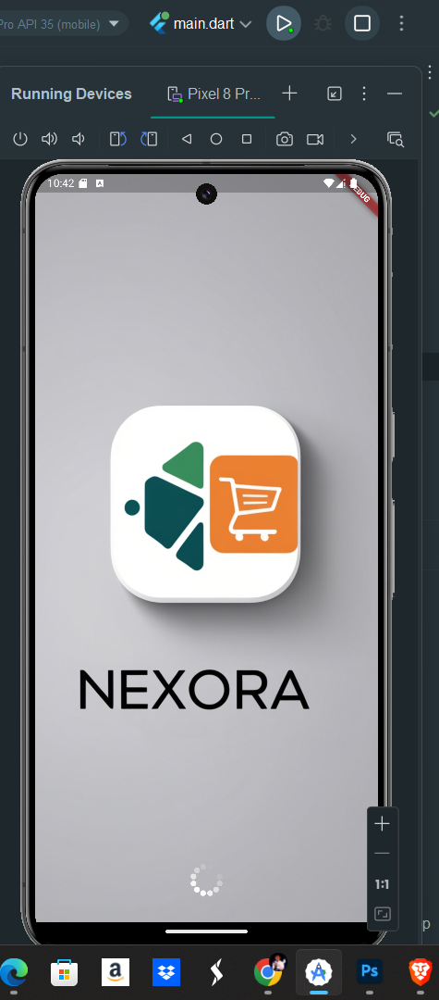
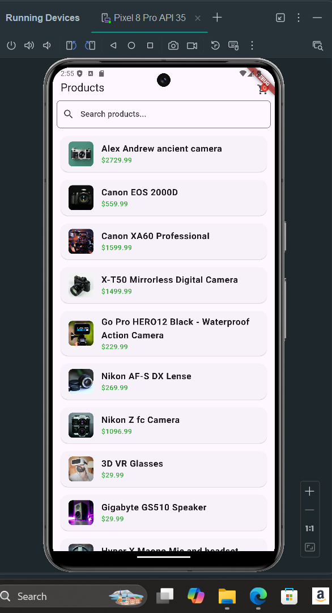
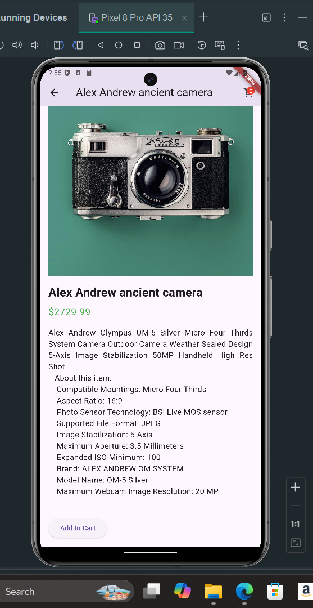

# Product App

A Flutter-based product listing application that allows users to browse products, view details, and add items to a cart. The app features a clean and responsive UI, a search bar to filter products by name, and a professional splash screen with animations.

## Features

- **Product Listing:** Displays a list of products with names, images, and prices. Users can search products by name using the search bar.
- **Product Details:** Detailed view for each product, including a multiline description and an option to add the product to the cart.
- **Cart:** Users can add products to the cart, view the cart, and remove items as needed. The cart items persist across app sessions.
- **Splash Screen:** The app features a splash screen with a full-screen image and animations.
- **Responsive Design:** The app is designed to be clean, responsive, and user-friendly.

## Screenshots





## Installation

### Prerequisites

- [Flutter SDK](https://flutter.dev/docs/get-started/install) installed on your machine.
- A suitable IDE like [Android Studio](https://developer.android.com/studio) or [Visual Studio Code](https://code.visualstudio.com/).

### Setup Instructions

1. **Clone the Repository:**

   ```bash
   git clone https://github.com/your-username/your-repo-name.git
   cd your-repo-name

